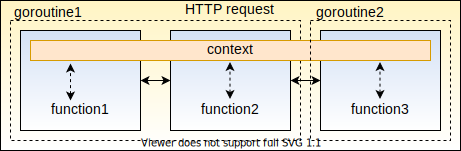

## Golang 

* https://www.interviewbit.com/golang-interview-questions/

# What is Golang?

Go is a high level, general-purpose programming language that is very strongly and statically typed by providing support for garbage collection and concurrent programming. 
In Go, the programs are built by using packages that help in managing the dependencies efficiently. It also uses a compile-link model for generating executable binaries from the source code. Go is a simple language with elegant and easy to understand syntax structures. It has a built-in collection of powerful standard libraries that helps developers in solving problems without the need for third party packages. Go has first-class support for Concurrency having the ability to use multi-core processor architectures to the advantage of the developer and utilize memory efficiently. This helps the applications scale in a simpler way.

# Why should one learn Golang? What are the advantages of Golang over other languages?

Go language follows the principle of maximum effect with minimum efforts. Every feature and syntax of Go was developed to ease the life of programmers. Following are the advantages of Go Language:

Simple and Understandable: Go is very simple to learn and understand. There are no unnecessary features included. Every single line of the Go code is very easily readable and thereby easily understandable irrespective of the size of the codebase. Go was developed by keeping simplicity, maintainability and readability in mind.
Standard Powerful Library: Go supports all standard libraries and packages that help in writing code easily and efficiently.
Support for concurrency: Go provides very good support for concurrency using Go Routines or channels. They take advantage of efficient memory management strategies and multi-core processor architecture for implementing concurrency.
Static Type Checking: Go is a very strong and statically typed programming language. Statically typed means every variable has types assigned to it. The data type cannot be changed once created and strongly typed means that there are rules and restrictions while performing type conversion. This ensures that the code is type-safe and all type conversions are handled efficiently. This is done for reducing the chances of errors at runtime.
Easy to install Binaries: Go provides support for generating binaries for the applications with all required dependencies. These binaries help to install tools or applications written in Go very easily without the need for a Go compiler or package managers or runtimes.
Good Testing Support: Go has good support for writing unit test cases along with our code. There are libraries that support checking code coverage and generating code documentation.


# Slice vs Array

Go Slice is an abstraction over Go Array. Go Array allows you to define variables that can hold several data items of the same kind but it does not provide any inbuilt method to increase its size dynamically or get a sub-array of its own. Slices overcome this limitation. It provides many utility functions required on Array and is widely used in Go programming.
To define a slice, you can declare it as an array without specifying its size. Alternatively, you can use `make` function to create a slice.

```golang
/* a slice of unspecified size */
var numbers []int 
numbers == []int{0,0,0,0,0}
/* a slice of length 5 and capacity 5*/
numbers = make([]int,5,5) 
/* missing lower bound implies 0*/
fmt.Println("numbers[:3] ==", numbers[:3])
/* add one element to slice*/
numbers = append(numbers, 1)
/* copy content of numbers to numbers1 */
copy(numbers1,numbers)
```
# Pointer

```golang
var a int
a = 1
/* Memory address */
fmt.Println(&a)
/* Value */
fmt.Println(*(&a))
```
## Passing by value/pointer

Passing by value in Go may be significantly `cheaper` than passing by pointer. This happens because Go uses escape analysis to determine if variable can be safely allocated on function's stack frame, which could be much cheaper then allocating variable on the heap.

# Range 

The range keyword is used in for loop to iterate over items of an array, slice, channel or map.

```golang
/* create a slice */
numbers := []int{0,1,2,3,4,5,6,7,8} 

/* print the numbers */
for i:= range numbers {
    fmt.Println("Slice item",i,"is",numbers[i])
}
```

# Map

Given a key and a value, you can store the value in a Map object. After the value is stored, you can retrieve it by using its key.


```golang
var countryCapitalMap map[string]string
/* create a map*/
countryCapitalMap = make(map[string]string)

/* insert key-value pairs in the map*/
countryCapitalMap["France"] = "Paris"
countryCapitalMap["Italy"] = "Rome"
countryCapitalMap["Japan"] = "Tokyo"
countryCapitalMap["India"] = "New Delhi"
```

# Concurrency

## Goroutine

* https://itnext.io/how-to-write-bug-free-goroutines-in-go-golang-59042b1b63fb
* https://tutorialedge.net/golang/concurrency-with-golang-goroutines/

### Small Goroutines vs Big Goroutines?

https://tpaschalis.github.io/goroutines-size/

### How many Goroutines is too many?

On a machine with 4 GB of memory installed, this limits the maximum number of goroutines to slightly less than 1 million. Your conversion from ~4k/per goroutine (this has changed from release to release; and you need to also account for the goroutine stack usage) to a maxium based on memory installed is flawed.

```golang
go sample(c) { /* ... */ }
```
Golang and channel
```golang
func main() {
	c := make(chan string)
	go sayHello(c)
	fmt.Println( <-c )
}

func sayHello(ch chan string) {
	ch <- "hello"
}
```

## Channel


# Context

context is a standard package of Golang that makes it easy to pass *request-scoped values*, *cancelation signals*, and *deadlines* across API boundaries to all the goroutines involved in handling a request.



func `Background()` returns *a non-nil, empty Context*. It is never canceled, has no values, and has no deadline. It is typically used by the main function, initialization, and tests, and as the top-level Context for incoming requests.

func `TODO()` Context, returns *a non-nil, empty Context*. Code should use context. TODO when it's unclear which Context to use or it is not yet available (because the surrounding function has not yet been extended to accept a Context parameter).

func `.WithTimeout(parent Context, timeout time.Duration)` context, This allows the use of contexts for cancellation, timeouts, and passing request-scoped data in other library packages.


# Race condition in golang 

https://medium.com/dm03514-tech-blog/golang-candidates-and-contexts-a-heuristic-approach-to-race-condition-detection-e2b230e70d08

# How does mutex work?

* Unsynchronized data access, which results in race conditions.
* Mutex is created in an unlocked state.
* When the first call to mutex.Lock() is made, mutex state changes to Locked.
* Any other calls to mutex.Lock() will block the goroutine until mutex.Unlock() is called
* So, only one thread can access the critical section.

```go
package main

import (
	"context"
	"fmt"
	"sync"
	"time"
)

var sharedMapForMutex map[string]int = map[string]int{}
var mapMutex = sync.Mutex{}
var mutexReadCount int64 = 0

func runMapMutexReader(ctx context.Context, readChan chan int) {
	readCount := 0
	for {
		select {
		case <-ctx.Done():
			fmt.Println("reader exiting...")
			readChan <- readCount
			return
		default:
			mapMutex.Lock()
			var _ int = sharedMapForMutex["key"]
			mapMutex.Unlock()
			readCount += 1
		}
	}
}

func runMapMutexWriter(ctx context.Context) {
	for {
		select {
		case <-ctx.Done():
			fmt.Println("writer exiting...")
			return
		default:
			mapMutex.Lock()
			sharedMapForMutex["key"] = sharedMapForMutex["key"] + 1
			mapMutex.Unlock()
			time.Sleep(100 * time.Millisecond)
		}
	}
}

func startMapMutexReadWrite() {
	testContext, cancel := context.WithCancel(context.Background())

	readCh := make(chan int)
	sharedMapForMutex["key"] = 0

	numberOfReaders := 15
	for i := 0; i < numberOfReaders; i++ {
		go runMapMutexReader(testContext, readCh)
	}
	go runMapMutexWriter(testContext)

	time.Sleep(2 * time.Second)

	cancel()

	totalReadCount := 0
	for i := 0; i < numberOfReaders; i++ {
		totalReadCount += <-readCh
	}

	time.Sleep(1 * time.Second)

	var counter int = sharedMapForMutex["key"]
	fmt.Printf("[MUTEX] Write Counter value: %v\n", counter)
	fmt.Printf("[MUTEX] Read Counter value: %v\n", totalReadCount)
}
```


https://medium.com/trendyol-tech/race-conditions-in-golang-511314c0b85

# sync.WaitGroup

We can use a WaitGroup to wait for multiple goroutines to finish.

```go
package main

import (
	"fmt"
	"sync"
)

var wg sync.WaitGroup

func hello() {
	defer wg.Done()
	fmt.Println("hello from a goroutine!")
}

func main() {
	wg.Add(1)
	defer wg.Wait()
	go hello()
}
```

# Deadlock

A deadlock happens when a group of goroutines are waiting for each other and none of them is able to proceed. For example: When one goroutine try to receive message from channel. And channel is empty. In db we need use smaller tasks and smaller queries.


# Rune

Rune literals are just 32-bit integer values (however they're untyped constants, so their type can change. They represent unicode codepoints. For example, the rune literal 'a' is actually the number 97.

```go
package main
 
import (
    "fmt"
    "reflect"
)
 
func main() {
 
    // Creating a rune
    rune1 := 'B'
    rune2 := 'g'
    rune3 := '\a'
 
    // Displaying rune and its type
    fmt.Printf("Rune 1: %c; Unicode: %U; Type: %s", rune1, rune1, reflect.TypeOf(rune1))
    fmt.Printf("\nRune 2: %c; Unicode: %U; Type: %s", rune2, rune2, reflect.TypeOf(rune2))
    fmt.Printf("\nRune 3: Unicode: %U; Type: %s", rune3, reflect.TypeOf(rune3))

}
```

output

```bash
Rune 1: B; Unicode: U+0042; Type: int32
Rune 2: g; Unicode: U+0067; Type: int32
Rune 3: Unicode: U+0007; Type: int32
```

# Design pattern

# Build project

# Package manager

# Text manipulators and templates

```golang
x.(Type)
fmt.sprintf("format is %T", a)
var sum int = 17
var count int = 5
var mean float32
mean = float32(sum)/float32(count)
fmt.Printf("Value of mean : %f\n",mean)
```

# Memory managment + Grabeg Collectors

https://medium.com/safetycultureengineering/an-overview-of-memory-management-in-go-9a72ec7c76a8

https://medium.com/@edwardpie/understanding-the-memory-model-of-golang-part-2-972fe74372ba

# Refrence in Int

```golang
package main

const N = 3

func main() {
	m := make(map[int]*int)

	for i := 0; i < N; i++ {
		// m[i] = &i    // try to only change this part so that the program prints "012"
		item := new(int)
		*item = i
		m[i] = item
	}

	for _, v := range m {
		print(*v)
	}
}

```


# What is an interface{}?

An interface{} is a collection of type implementable method signature.

# Inherritance

Inheritance means inheriting the properties of the superclass into the base class and is one of the most important concepts in Object-Oriented Programming. Since Golang does not support classes, so inheritance takes place through struct embedding. We cannot directly extend structs but rather use a concept called composition where the struct is used to form other objects. So, you can say there is No Inheritance Concept in Golang.


# Memory Issue in GOLANG

We point to nill address or 